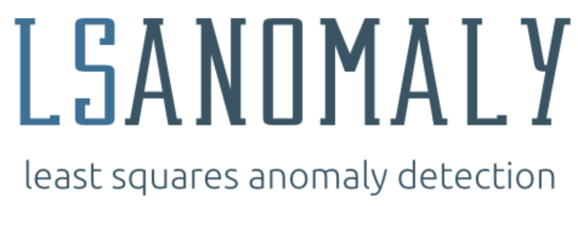

.. Least Squares Anomaly Detection documentation master file, created by
   sphinx-quickstart on Tue Dec 17 12:12:16 2019.
   You can adapt this file completely to your liking, but it should at least
   contain the root `toctree` directive.

|PyPI| |Language| |License| |Documentation|

`lsanomaly` is a flexible, fast, probabilistic method for calculating outlier scores on test data, given
training examples of inliers. Out of the box it works well with `scikit-learn` packages. See the features section
for why you might chose this model over other options.

Table of Contents
-----------------

-  `Features`_
-  `Installation`_
-  `Usage`_
-  `Documentation`_
-  `Examples`_
-  `Reference`_
-  `License`_

Features
--------

-  Compatible with scikit-learn package modules
-  Probabilistic outlier detection model
-  Robust classifier when given multiple inlier classes
-  Easy to install and get started

Installation
------------

The best way to install lsanomaly is to:

::

    pip install lsanomaly

An alternative is to download the source code and

::

   python setup.py install

Tests can be run from `setup` if `pytest` is installed:

::

   python setup.py test

Usage
-----

For those familiar with scikit-learn the interface will be familiar, in fact `lsanomaly` was built to be compatible
with `sklearn` modules where applicable. Here is basic usage of `lsanomaly` to get started quick as possible.

**Configuring the Model**

LSAD provides reasonable default parameters when given an empty init or it can be passed values for `rho` and `sigma`. The value rho controls sensitivity to outliers and sigma determines the ‘smoothness’ of the
boundary. These values can be tuned to improve your results using lsanomaly.

.. code:: python

    from lsanomaly import LSAnomaly

    # At train time lsanomaly calculates parameters rho and sigma
    lsanomaly = LSAnomaly()
    # or
    lsanomaly = LSAnomaly(sigma=3, rho=0.1, seed=42)

**Training the Model**

After the model is configured the training data can be fit.

.. code:: python

   import numpy as np
   lsanomaly = LSAnomaly(sigma=3, rho=0.1, seed=42)
   lsanomaly.fit(np.array([[1],[2],[3],[1],[2],[3]]))

**Making Predictions**

Now that the data is fit, we will probably want to try and predict on some data not in the training set.

.. code:: python

    >>> lsanomaly.predict(np.array([[0]]))
    [0.0]
    >>> lsanomaly.predict_proba(np.array([[0]]))
    array([[ 0.7231233,  0.2768767]])

Documentation
-------------
Full documentation can be built using Sphinx.

Examples
--------
See `notebooks/` for sample applications.

Reference
---------

J.A. Quinn, M. Sugiyama. A least-squares approach to anomaly detection in static and sequential data. Pattern Recognition Letters 40:36-40, 2014.

[`pdf`_]

.. _Features: #features
.. _Installation: #installation
.. _Usage: #usage
.. _Documentation: #documentation
.. _Examples: #examples
.. _License: #license
.. _here: https://
.. _pdf: http://air.ug/~jquinn/papers/PRLetters_LSAnomalyDetection.pdf

.. |PyPI| image:: https://img.shields.io/pypi/v/lsanomaly.svg?maxAge=259200
          :target: https://pypi.python.org/pypi/lsanomaly
.. |Language| image:: https://img.shields.io/badge/language-python-blue.svg?maxAge=259200
.. |Documentation| image:: https://img.shields.io/badge/docs-100%25-brightgreen.svg?maxAge=259200
.. |License| image:: https://img.shields.io/badge/license-MIT-7f7f7f.svg?maxAge=259200

Least Squares Anomaly Detection API
-----------------------------------

.. toctree::
   :maxdepth: 2
   :caption: Contents:

Indices and tables
==================

* :ref:`genindex`
* :ref:`modindex`
* :ref:`search`

Least Squares Anomaly Detection
===============================

.. autoclass:: lsanomaly._lsanomaly.LSAnomaly
   :members: fit, predict, predict_proba, decision_function, score, predict_sequence

Kernel Length Scale Approximation
=================================
.. automodule:: lsanomaly.lengthscale_approx
   :members: median_kneighbour_distance, pair_distance_centile

Evaluating LSAnomaly
--------------------
Scripts for evaluating `lsanomaly` against other methods is provided in J Quinn's software
https://cit.mak.ac.ug/staff/jquinn/software/lsanomaly.html.
Owing to changes in APIs and availability of some test data, that code has been refactored and expanded.

There are three commandline applications that will be download the test data, perform a 5-fold
cross-validation and, produce a LaTeX document summarizing the results. Each of the three applications has
a `main` method that can be used for further automation.

The following datasets are configured for download (see `evaluate/eval_params.yml`) from
https://www.csie.ntu.edu.tw/~cjlin/libsvmtools/datasets/.

- australian
- breast-cancer
- cod-rna
- colon-cancer.bz2
- diabetes
- dna.scale
- glass.scale
- heart
- ionosphere_scale
- letter.scale
- leu.bz2
- mnist.bz2
- mushrooms
- pendigits
- satimage.scale
- sonar_scale

Those with an extension of `.bz2` will be inflated. The compressed
version is retained.

Downloading Test Data
=====================
.. automodule:: lsanomaly.evaluate.download
   :members: main, unzip_write, write_contents, get_request

Evaluating the Test Data
========================
.. automodule:: lsanomaly.evaluate.run_eval
   :members: evaluate, gen_data, gen_dataset, main

Create a Results Table in LaTeX
===============================
.. automodule:: lsanomaly.evaluate.generate_latex
   :members: results_table, main

License
-------
The MIT License (MIT)

Copyright (c) 2016 John Quinn

Permission is hereby granted, free of charge, to any person obtaining a
copy of this software and associated documentation files (the
“Software”), to deal in the Software without restriction, including
without limitation the rights to use, copy, modify, merge, publish,
distribute, sublicense, and/or sell copies of the Software, and to
permit persons to whom the Software is furnished to do so, subject to
the following conditions:

The above copyright notice and this permission notice shall be included
in all copies or substantial portions of the Software.

THE SOFTWARE IS PROVIDED "AS IS", WITHOUT WARRANTY OF ANY KIND, EXPRESS OR
IMPLIED, INCLUDING BUT NOT LIMITED TO THE WARRANTIES OF MERCHANTABILITY,
FITNESS FOR A PARTICULAR PURPOSE AND NONINFRINGEMENT. IN NO EVENT SHALL THE
AUTHORS OR COPYRIGHT HOLDERS BE LIABLE FOR ANY CLAIM, DAMAGES OR OTHER
LIABILITY, WHETHER IN AN ACTION OF CONTRACT, TORT OR OTHERWISE, ARISING
FROM, OUT OF OR IN CONNECTION WITH THE SOFTWARE OR THE USE OR OTHER DEALINGS
IN THE SOFTWARE.

